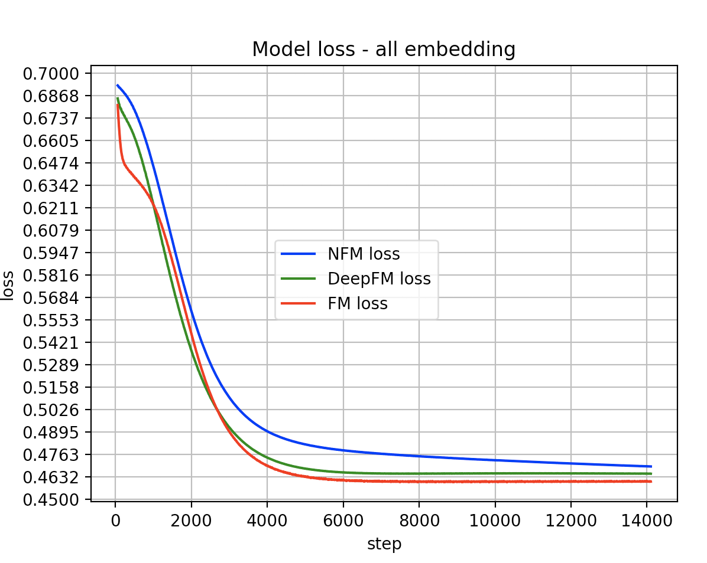

# NFM
## 介绍
**- 原论文题目：《Neural Factorization Machine for Sparse Predictive Analytics》**

**- 原论文地址：[nfm](https://arxiv.org/pdf/1708.05027v1.pdf)**

**- 论文整理：[nfm论文整理]()**

下面对本论文提出的模型进行了复现。

## 模型架构

<<<<<<< HEAD
**模型结构 = FM线性部分 + DNN(BI as input)**


## 使用

**1.数据准备**

+ 训练集和测试集需为.csv文件
+ 支持**数值型特征映射为embedding**,也支持**数值型特征直接作为DNN输入**
+ 支持**多值离散特征**的处理,可自行配置为sum or mean,分隔符请用"|"
+ **cat特征**需要自行先用labelEncoder转换一下

具体配置在**Config.py**文件中，也可结合ex_data中的例子作为参考。

**转换完成后的训练数据示例:**

```
1,18:1,30:1,0:0.25,2:0.8125,4:0.0,6:0.0,8:0.0,10:0.006630292147247738,12:0.8125,14:0.25,16:0.5625,
```
 

**2.模型训练**

+ 先在Config中指定单值离散，多值离散，连续型特征
+ 默认激活函数"relu",默认optimizer"Adagrad"
+ 默认DNN网络结构 [100,100,100]
+ 默认建立vocabulary的最低词频 10

**3.模型实验**

**- Batch_size : 4096 , epochs: 2000**

**- 指标为"logloss"**  

**- 数据为 “2018中国高校大数据挑战赛” 初赛数据**



从实验结果可以看出，**NFM模型不如DeepFM模型，无论从精度还是收敛速度来说**，当然DeepFM也是后提出的，但是理论上这两个hybrid模型都应该强于FM模型。

这里因为是把数值型的特征也做embedding了，所以DNN表现比较差，即使我已经加入**归一化和batch-normalizaition**了，因此**下面继续做实验验证数值型特征直接作为DNN输入**。


=======
>>>>>>> f89207578d9545fbacda3b10324a1ed49e84ba98

