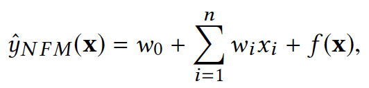
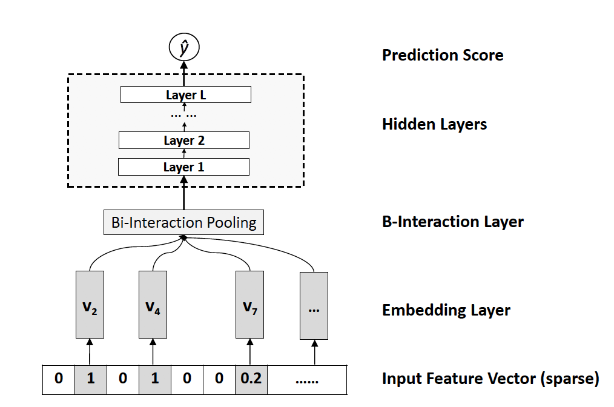

# Neural Factorization Machines for Sparse Predictive Analytics

## Abstract

因子分解机FM是一种提取二阶交互特征非常流行的方法，是一种线性提取交互特征的方法，但是现实中的数据往往是复杂的非线性的。在本篇论文中，提出了一种模型“神经因子分解机NFM”，主要用于处理很多稀疏特征的推荐场景。主要是组合了**FM的线性二阶部分**以及神经网络的**非线性高阶交叉部分**。

引入的方式是通过一个**BI层(Bilinear Interaction pooling)**, 与传统的深度学习方法简单的拼接或者取平均不同，**这种方式可以编码更多的特征交互信息**。

## MODELING FEATURE INERACTIONS

论文中一些关于embedding的说明就不介绍了，首先是介绍了FM模型，很简单：

缺点一个是**参数很多**，第二个是**只有$x_i$和$x_j$都不为0的样本才能使得对应的参数得到训练**，在稀疏性的场景下不太友好，从公式也能看出，就是一个LR加入线性的二阶交叉，FM可以模仿很多的模型例如：Standard MF, parallel factor analysis, and SVD++

基于FM模型，产生了很多的FM的变种，比如Co-FMs，ffm(field-aware FM)，attention FM(可以学习交叉特征的重要性)，**但是所有这些变种依然是线性的而且最高只能提取到二阶交叉特征。**

基于**将预训练的FM层当做DNN的输入**可以产生很不错的效果，本文提出了这种NFM模型。

近年来关于DNN的开发一直在进行，但是如何将推荐中的大量稀疏性特征用于DNN，充分的发挥DNN的作用仍然是个问题，近年来提出的**NCF(neural collaborative filtering)可以学习用户和item之间的交互**，然后NCF又被拓展成**attribute-aware CF,** 然而这几种模型只能作用于两个特征的交互而**不能适用于泛化的特征**，然后就又出现了**FNN(FM-supported Neural Network),** 就是刚刚说的用**预训练的FM的embedding**作为DNN的输入，后来又出现了DeepCross模型，是基于Deep&Wide修改而来的。

然而，使用FM的embedding直接作为DNN的输入有一点坏处，作者认为这样简单的拼接会把低阶的交互特征给扔掉，这样就会把挖掘交叉特征的重任全部交给DNN，然而DNN又有一系列诸如梯度爆炸，消失，过拟合等一系列问题使得它并不那么可靠。因此，我们通过BI层来事先挖掘出二阶部分的交叉特征，然后再输入给DNN去挖掘高阶特征

## NEURAL FACTORIZATION MACHINE

NFM模型公式如下:

其中$f(x)$就是NFM模型的核心部分，就是一个预先过BI层的神经网络

**整个NFM的网络结如下：**

其中Embedding Layer就是普通的embedding layer，没有什么特殊的地方，而在**BI层是通过如下方式对Embedding layer进行处理的**：

也很简单，就是一个**element-wise product**，举个例子：

很显然，BI层的输出是一个k-dimension的dense vectir,这里的k是embedding size,这样就可以表示了特征的二阶交互部分，接下来就是过一个DNN了，没什么特殊的，总体的NFM公式是:

## OTHERS

后面用了Drop-out和batch-normalization,都是比较常用的手段，这里不介绍了。

**这是论文中的实验：**

