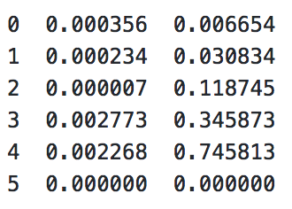

# Q-learning

Q-learning是强化学习中比较简单的一种方法，其算法步骤如下图：

整个算法就是一直不断更新 Q table **(行是state，列是action，值是Q值)**里的值, 然后再根据新的值来判断要在某个 state 采取怎样的 action.

## demo

**本例中的demo如下：**

-O---T

如何让O学习到达右边的T

**最终学习到的Q-table如下图:**

