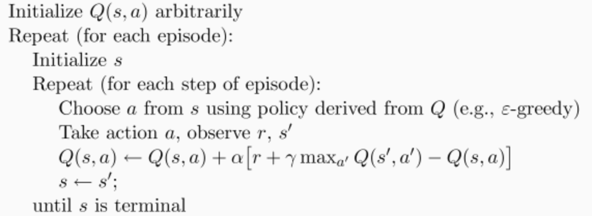

# Q-learning

Q-learning是强化学习中比较简单的一种方法，其算法步骤如下图：

整个算法就是一直不断更新 Q table **(行是state，列是action，值是Q值)**里的值, 然后再根据新的值来判断要在某个 state 采取怎样的 action.

## demo

**本例中的demo如下：**

-O---T

如何让O学习到达右边的T

最终学习到的Q-table如下图

**Q-table:**

0  0.000356  0.006654
1  0.000234  0.030834
2  0.000007  0.118745
3  0.002773  0.345873
4  0.002268  0.745813
5  0.000000  0.000000

