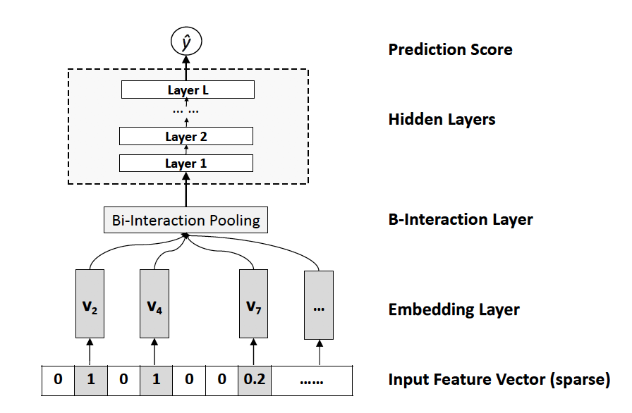

# Machine-Learning

## 轮子
+ [自编码 AutoEncoder](https://github.com/batch-norm/Machine-Learning/tree/master/AutoEncoder)

## 论文整理
+ [NFM:Neural Factorization Machine for Sparse Predictive Analytics](https://github.com/batch-norm/Machine-Learning/tree/master/NFM/paper)

+ [xDeepFM:Combining Explicit and Implicit Feature Interactions for Recommender Systems](https://github.com/batch-norm/xDeepFM)

+ [Deep Neural Network for Youtube Recommendation](https://github.com/batch-norm/Machine-Learning/tree/master/youtube)

## 模型复现

+ [nfm模型](https://github.com/batch-norm/Machine-Learning/tree/master/NFM)

+ [xdeepfm模型](https://github.com/batch-norm/xDeepFM/tree/master/paper)

