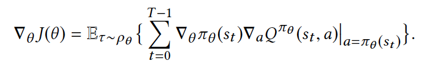

# RL to rank in E-commerce Search Engine

## ABSTRACT

在电商平台中，在搜索会话中对商品进行排序是一个典型的多步决策问题，Learning to Rank(LTR)方法被广泛的应用于该问题。然而，这些方法没有考虑不同决策步骤之间的联系，本文提出了一种利用强化学习来学习使得累积收益最大的ranking公式

1.首先，为了说明多步排序问题，首先引入了搜索会话中的马尔科夫决策过程(SSMDP)

2.然后分析了SSMDP的性质并在理论上证明了使得累积收益最大的必要性

3.提出了一种新颖的policy gradient algorithm解决了reward的高方差和reward的分布不均衡问题

##  INTRODUCTION

**多步排序问题:**

1.用户在搜索框中输入查询词条

2.搜索引擎根据ranking公式展示TopN的商品给用户

3.用户对展示的商品进行操作

4.当用户翻到下一页的时候，搜索引擎对剩下的商品进行排序，如此循环

**结束的条件是用户购买了商品或者是结束搜索会话。**

**本文结构：**

1.正式定义了搜索过程中的马尔科夫决策过程的概念，明确了状态空间(state space),奖励函数(reward function),状态转移函数(state transition function)

2.理论上证明了累积收益最大化是必要的，并且多步搜索过程中的每一步是紧密联系的

3.提出了一种新颖的算法(deterministic policy gradient with full backup estimation)DBG-FBE,主要是针对奖励的方差太大并且分布不均衡设计的

## BACKGROUND

### Reinforcement Learning 

RL的基础数学模型是马尔科夫决策过程，其最终目的是位了找到一个policy使得从任意状态s开始都可以得到最优的期望累积收益，即如下：

其中policy为:

这个问题和最大化Q值函数是等价的(给定s和a)：

关键问题就是如何学习这种policy,有传统的方法比如**动态规划(基于值的值迭代和基于策略的策略迭代)**,但是这种DP的优化策略依赖于表格，在现实问题中由于状态空间和动作空间往往非常大，一般不可能用表格来表示

所以现在用的比较多的是函数逼近的方法(神经网络)，比如policy gradient，本文也用了一种类似的方法

## PROBLEM FORMULATION

### Search Session Modeling

为了定义问题，现实给出了一些比较重要的定义：

**3.1 Top K List :** 对于商品几何$D$,一个排序公式$f$,Top K list 就是根据排序公式得到的评分最高的k个商品

**3.2 Item page:** 对于商品搜索会话中的每一步，Item page指的是每一步中的top K List(从未被展示过的商品中选取topK)

**3.3 Item Page History:**  在每个搜索会话中，初始化step=0, 初始化Item page history $h_0$= $q$ (搜索词),对于每一步t>=1($p_t$是item page):

由于每一页展示的商品数是k个，总的商品是D个，那么总共是有 D/k 页，也就是最多会有 D/k 个step

**3.4 Conversion Probability:** 用户在一次搜索session中发生购买行为的平均概率$b(h_t)$

**3.5 Abandon Probability :** 用户在一次搜索会话中结束session的平均概率

所以，这几种概率决定了在状态$h_{t-1}$进行动作$a_{t-1}$以后状态是如何变化的，分别是**成交概率**$b(h_t)$,**离开概率**$l(h_t)$

**3.6 Continuing Probability:** 所以继续浏览概率也很容易定义，$c(h_t)$ = 1 - $b(h_t)$ - $l(h_t)$

### Search Session MDP

**马尔科夫过程**：

然后就可以定义"**搜索会话中的马尔科夫过程**"：

注意其状态空间是由三个子状态空间组成的，分别是一个非结束状态集和两个结束状态集。A是action space,包含了所有可能的ranking公式。

## ANALYSIS OF SSMDP

### Markov Property

证明了SSMDP满足马尔科夫性

### Reward Function

对于任何一个非结束状态$s = C(h_t)$，根据某个action可以得到$s'$，这个时候可以定量的来描述Reward = $R(s,a,s')$,在电商平台中，最为重要的事情是交易，因此奖励应该是基于成功的交易。因此采用了跟价格相关的函数来定义奖励函数：

对于一个状态，其$R(s,a,s')$为：

由于我们在初始化的时候定义了$h_0=q$，因此如果在第一页ranking公式就促成了一笔交易的话，那么就可以直接得到$m(h_{t+1})$的奖励，否则为0。(实际应用中，直接使用交易成功的价格作为奖励值)

### Discount Rate

主要描述衰减率应该如何设定，在搜索过程中是否需要考虑长期累积收益。

**定义值函数**：

**定义expected gross merchandise volume (GMV):**

经公式推导得，取衰减系数为1的时候:

也就是说，**从GMV方面考虑，最大化非折扣收入是最优的，也就是取衰减系数为1的时候。**

## ALGORITHM

为了学习最优的ranking公式，这里使用了**policy gradient**方法，先说一下Policy Gradient

**对于强化学习任务来说，其目标都是使得带衰减系数的reward的累积收益最大**，由于上面已经确定了我们的衰减系数为1，因此可以表示为如下公式:

但是这个**损失函数跟Policy Network网络没有直接的联系**，reward是环境给出的，跟参数$\theta$没有直接上的运算关系，也就是**不能直接计算梯度**。

由于策略网络的**输入是状态，输出的是动作的概率**，然后根据环境得到reward, 这个时候可以引进一**个根据reward评判动作好坏的函数**，以此来通过**改变每个动作输出的概率来优化策略网络**。

因此这里还是利用了Q函数来输出在当前state和action条件下的Q值，也就是来评判当前的action的好与坏，而loss也变成了一个使得Q值最大化的问题，也就是使得$loss=-Q$最小，因此，策略网络的梯度其实是由策略网络的策略函数梯度乘以Q网络的Q值函数的梯度得到的:

其实也就是Actor-critic模型，Actor是策略网络，critic是Q网络，Q网络的损失函数是MSE:

模型的具体情况会在后面提到。

### The DPG-FBE Algorithm

**回顾之前考虑到的reward的两个问题：**

1.**方差大**，是因为**成交价格的差距很大**造成的

2.**即时回报分布不均衡**是因为**购买事件远远小于其他的事件**(退出事件和继续事件)

（怎么解决的呢？）

回顾Reward function:

只有最后一步的reward可能是非0值(在$s'$是购买的状态下),。

继续分析，Q函数如下(根据马尔科夫定理，最优的策略也对应最优的动作值函数)：

**(这里就是DQN的东西了，后面再补充)**

由于这里面只有下一个状态是$B(h_{t+1})$的时候$R(s,a,s')$是非0值，而只有当下一个状态是$C(h_{t+1})$的时候$Q$函数的值不为空(因为$Q$函数的值的计算需要基于其传入的状态$(s,a)$对应的$(s',a')$,而如果s对应的是$B(h_{t+1})或者L(h_{t+1})$的话session结束)，因此可以将公式简化为:

其中$b(h')$是成交概率，$m(h')$是期望交易价格，$c(h')$是继续概率。

这样就得到最终的Q值函数了，参数的更新可以基于最小化MSE误差：

其中,$Q^{\pi_{\theta}}$可以称为$Q$现实，而$Q^{w}$可以称为$Q$估计，为了进行梯度下降，求导数：

将$Q^{\pi_{\theta}}(s,a)$代入到上式中可以得到（这里应该就是称为full backup estimation的原因）:

这样就可以进行Q函数的参数更新了,也就是刚刚提到的critic网络。

$\alpha_w$是学习率。

对于三种概率$b(h_t),$$c(h_t)$,$l(h_t)$，都是在本模型之前使用其他模型预训练好的。

整个的算法流程如下：

## EXPRIMENTS

**线下模拟参数：**

**商品 :** 20个重要特征

**ranking :** 20维向量

**环境 :** 180维向量,根据前四个item page中抽取

**actor network :** 隐藏层神经元个数 200

**critic network :** 隐藏层神经元个数 100

**隐藏层激活函数 :** relu

**输出激活函数:** tanh

**actor optimizer** : Adam $10^{-5}$

**critic optimizer :** Adam $10^{-4}$

**soft update parameter:** $10^{-3}$

以下是DPG-FBE算法和其它算法的对比:

为了确保线上系统有处理高并发和海量数据的能力，设计的系统如下：

**系统总共包含两个循环：**

1.在线用户行为的循环(搜索引擎和用户之间的交互循环)

2.在线学习行为的循环

这两个循环通过 Online KV System和Log Center联系起来,一个来收集用户的日志，一个用来存储用于产生ranking参数的模型。

**具体过程：**

每当用户输入一个搜索词的时候，Online KV System会根据用户产生的state feature产生对应的ranking参数，然后Ranker对当前未被排序的商品进行排序，用户和已经排序好的商品产生交互，交互的行为历史在同时存入Log center以作为训练样本，每当模型根据训练样本训练以后，更新Online KV System中的模型。以上的两个loop是并行但是异步的，因为每个时刻产生的交互训练样本并不会被立即利用。

**线上参数：**

**ranking :** 27维向量

**环境 :** 90维向量，包含item page特征，user特征和query特征

**actor network :** 隐藏层神经元个数 80

**critic network :** 隐藏层神经元个数 64

## DDPG

DDPG算法：

**DDPG算法和DPG-FBE算法的区别：**

在DDPG算法中，每一个step都会对online policy网络和Q网络以及target policy网络和Q网络进行更新，但是之前提到过的购买价格方差和事件分布不均衡的问题，如果在本文定义的搜索问题中也对每一个step进行网络更新的话，下一个事件是是否是$B(h_{t+1})$对网络的更新影响很大，为了解决这种问题，采用了full backup estimation，对每个session为一个更新单元，使得参数的更新更加平滑稳定。

