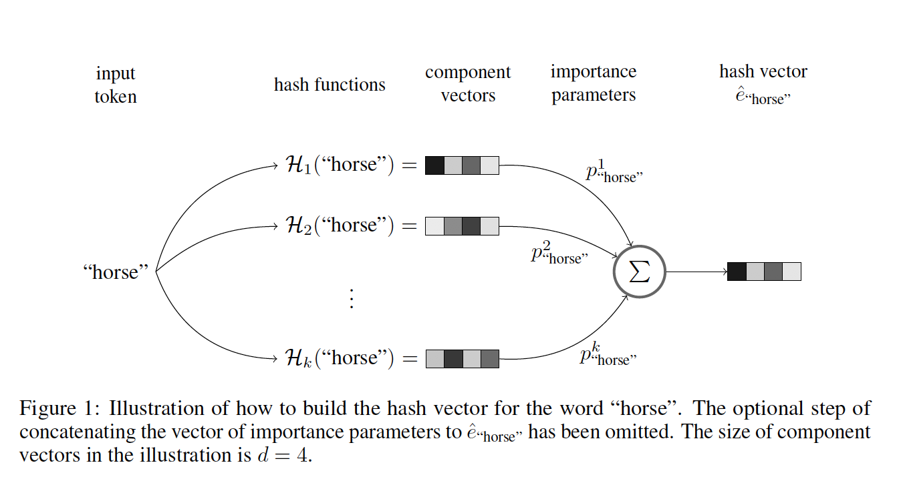
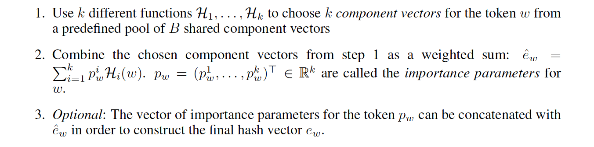
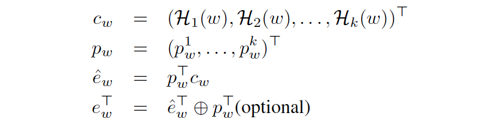
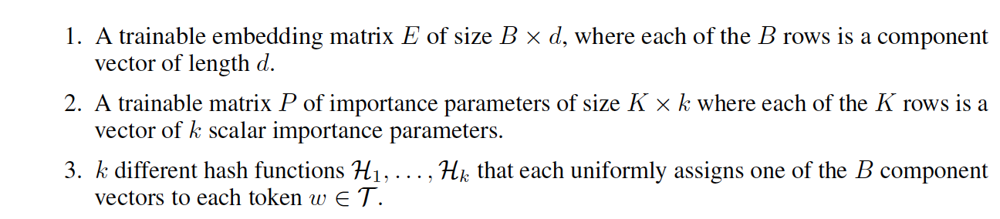

# Hash Embeddings for Effcient Word Representations

## Abstract

我们提出了"hash embedding"，一种表示词为连续向量的高效形式，hash embedding可以看做是标准的word embedding和random hash embedding的一种折中。词条的embedding是**从一个共享池B中选取的**，实验表明这种方法可以很轻易的处理巨大的词汇量。

使用hash embedding的好处是**无需提前创建vocabulary**，也不用在训练之后做任何的剪枝操作，**另外一个好处就是在使用更少的参数之下并不会有精度损失**，标准的word embedding和random hash embedding可以看做是**hash embedding的一种特殊形式**

## Introduction

首先是如果语料库巨大，那么embedding矩阵将会变得异常巨大，为了解决这个问题，有几个比较经典的解决方案：

+ **忽略低频词**。很多时候，文本的主体部分都是由一小部分高频子集，大部分单词出现的频率非常低，去掉这些低频词和一些stop words以外，剩下的高频词汇仍然可以表示大部分的文章语义。**但是其缺点是**，低频词的阈值不好控制，如果固定阈值的话，有时候会去掉太少，有时候会去掉太多，而且，低频词的重要性并不可知，根据词频来对词的重要性进行定性存在一些问题。
+ **去掉重要性低的词**。一些模型可以通过计算熵来计算特征重要性，然后只用比较重要的词汇进行训练，然而这种修剪词典的方法会造成精度损失，某些场景下可以避免过拟合，但是大部分场景下比如线上的时候是不适用的。
+ **压缩embedding向量**。对需要存储的embedding向量进行有损压缩。

然后在线上的时候，在训练之前建立字典往往是不可行的，一般都是直接feature hashing,有一个hash函数来将每个词条分配到一个固定集合的bucket中$\{1,2,3,4...B\}$ ,结果就是很多词条会产生hash冲突因为在hash之后的结果是一样的，这样本来不同的词条就会得到相同的embedding向量。但是即使是产生hash冲突会损失一些信息，这种方法仍然适用于大部分场景而且效果不俗。

基于上面这种hash方法的一种改进就是试验很多的hash function，取效果最好的哪一个，但是当然一个一个去试是非常低效而且收益不明确的。

本文提出了一种改进的方法是使用k个hash函数而不是一个hash函数，然后用k个可以训练的参数向量(importance vector)让每个token去选择最适合自己的hahs函数(或者也可以说是最适合自己的hash function组合)，我们把结果的embedding称为hash embedding，**这种结构有标准embedding和feature hashing embedding的所有优点**，**但是大大改善了以下缺点**：

+ 使用hash embedding就**不需要事先创建字典**并且可以**适用于动态扩张的字典**
+ Hash embedding有**隐式修剪词典的能力**
+ Hash embedding基于hashing但是有**可训练的避免hash冲突的机制**
+ Hash embedding有点像**乘积量化**(一种图像检索方法)

## Hash Emebddings

下面介绍具体是如何产生hash embedding的：

其中，上述的component vectos是从共享embedding池B中选出的，然后对每个(k个)component vector乘以一个Importance系数，这个系数来自于一个K x k的importance矩阵。

下面是用公式表示整个转换过程：

最后式子表示concatenation, 是将Importance向量和最终的embedding向量做concatenation,是可选的。

所以我们最后一共需要**三个东西：**

最终hash embedding需要的参数的个数为B · d + K· k 而一个标准的embedding需要的参数个数为K · d ,在模型效果不变的情况下，可以尽量选小的$k$和$B$我们一般选k=2并且K > 10 · B

就训练速度来说，hash embedding并没有提升，其重要的作用是减少参数，不需要预建字典，减少hash冲突

## others

后面是实验和结论，不介绍了

