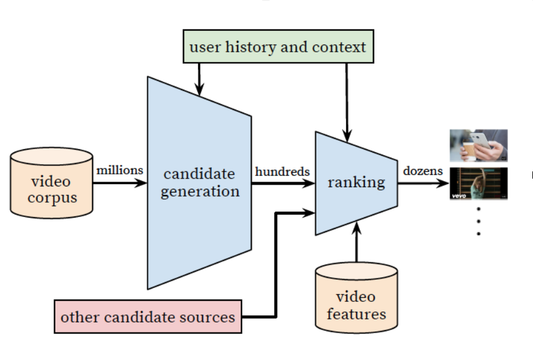
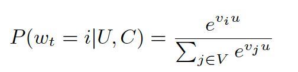
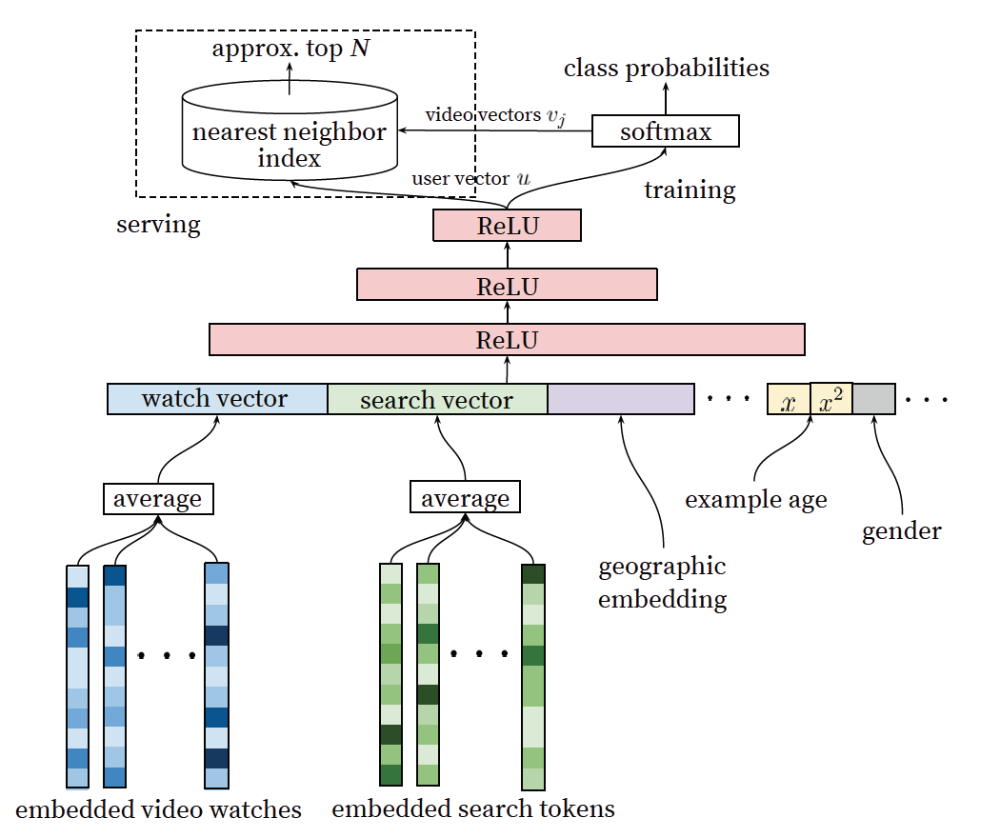
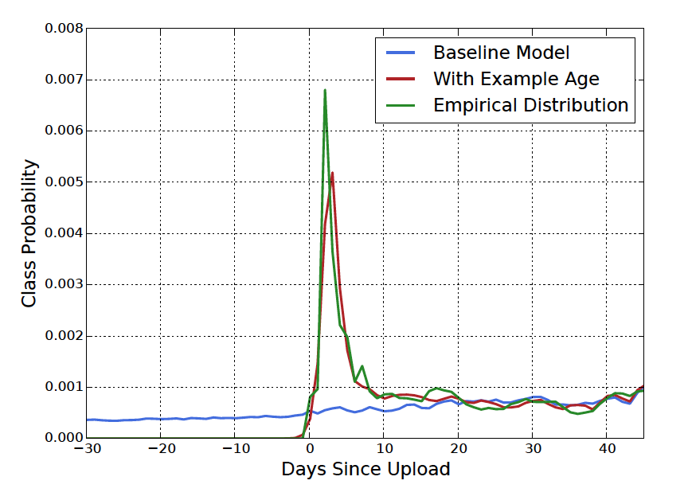
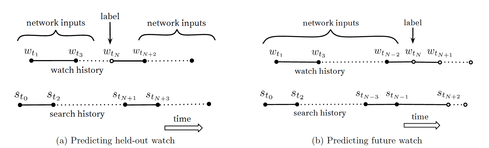
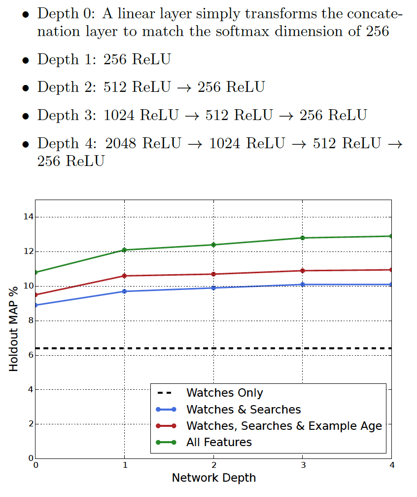
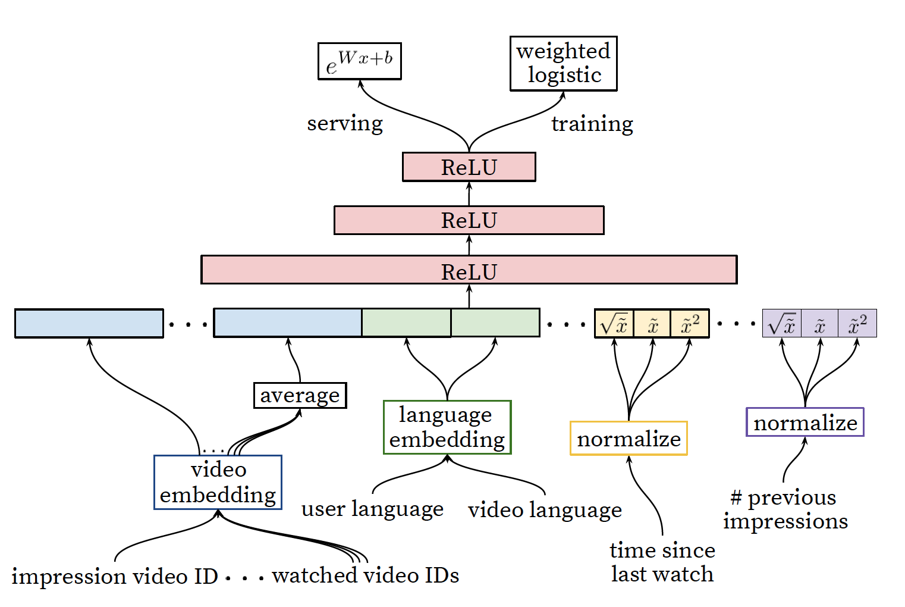
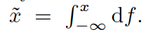
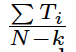
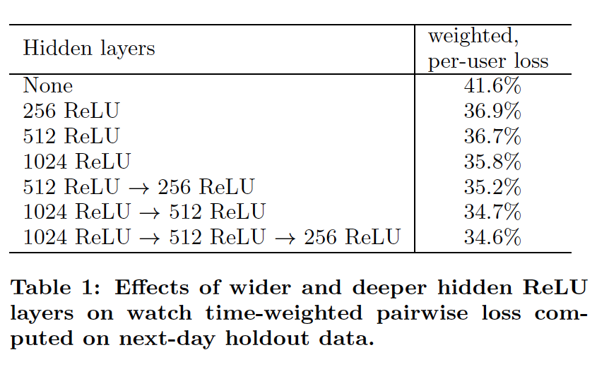

## Abstract

**本文主要介绍两种模型：**

+ 深度候选集生成模型 “Deep candidate generation model”
+ 深度排序模型

## 关键词

+ 推荐系统
+ 深度学习
+ 海量数据

## 介绍

Youtube是目前世界上最大的视频网站，其服务的用户超10亿，由于Youtube的推荐系统主要面临着以下三个挑战：

+ 规模：Youtube每秒钟就有总长几万小时的视频上传，那些在小数据上表现好的算法放在这里效果很差
+ 新鲜度：传统的E&E问题
+ 噪音：用户历史行为稀疏不完整，没有非常明确的满意度反馈，视频信息非结构化

## 系统总览

系统总体架构如下：

首先是召回模型根据简单的用户历史和上下文信息从几百万的视频库中召回几百个候选视频，然后排序模型基于大量的特征对每个视频进行打分，将最终排序的结果呈现给用户，最终效果通过线上A/B test来验证。

## CANDIDATE GENERATION

在深度候选集召回模型中，需要从海量的视频中进行召回，以前用的非常多的方法是矩阵分解，本文的方法其实是一种非线性的矩阵分解(其实很好理解，一会看到模型结构你们就懂了)

### Recommendation as Classfication

这里是将召回问题转化为了一个多分类问题，因为类别如此之大，可以说是极限多分类了，最终的score由如下公式输出:

就是一个很正经的softmax而已，这里需要注意的是**u即我们要学习的user向量，v代表的是video向量**。

### Efficient Extreme Multiclass

类别如此之多的多分类模型，肯定是需要采取一些trick来避免庞大的计算量的。其中最主要的是“**Sampled softmax**”,感兴趣的可以自己去研究一下(其实这些sampled方法差不多，都是用极大似然的方法，通过一个人工设定的分布Q，来近似的表达真实的大数据集分布来避免全量计算)。

在线上阶段的时候需要在几十毫秒内计算出需要找回的TopN，因此问题可以简化为**点积空间中的最近邻搜索问题**。(这里论文里没展开说，我觉得从**局部敏感哈希**和**用户向量的KNN**入手都是可行的)

### Model Architecture 

最关键的部分：

借鉴了CBOW,输入是最近看过的N个视频id,还有搜索过的N个词，将不定长(个数不定)的稀疏向量通过加和或平均等手段转为定长向量，作为DNN的输入，其他特征如人口统计特征等不经emb直接作为输入。其中，emb参数矩阵作为整个网络的一部分参与训练，在神经网络反向传播过程中更新参数。在训练阶段，最后一层经过softmax输出概率(使用sampled softmax)，最终训练得到user vector和video vector矩阵，在线上阶段，通过最近邻搜索来进行有效率的打分和召回。

### Heterogeneous Signals

使用DNN来作为矩阵分解的一种泛化的好处就是可以任意加入连续特征或类别特征。例如ID类特征做embedding处理，像简单的二值特征、性别、登录状态、年龄等可以直接作为DNN的输入，实数特征做normalization处理。

**“example age” Feature**

关于如何将新鲜度作为特征，论文这里给出了一种方法，将视频已上传时长作为特征，训练集末尾的视频该特征置为0，从而取得了很不错的效果：

从上图可以看出，新上传的视频召回的概率大大增加，而这也与用户喜欢新视频的意愿相符。

### Label and Context Selection

训练集的选取是从整个Youtube视频库中选取的而不仅仅是展示(推荐)给用户的那些视频，否则新内容将很难有机会露脸，这样，如果用户是观看了其他的source而不是我们推荐的视频，那我们就可以协同过滤很快的把这种特性传播给其他用户。

还有一个需要注意的问题是要注意搜索词的顺序问题。例如一个用户刚刚搜索完"泰勒斯威夫特"，那么马上展示给她的肯定全部都是“泰勒斯威夫特”的内容，而我们当然不希望直接给用户推荐全部都是用户马上搜索过的内容(为了多样性的考虑)，因此在实际的应用中，需要打乱搜索词的顺序。

另外，用户观看存在一种模式，例如对于一些电视剧，往往会一直追着看，因此未来时间的消费(观看)就和过去的消费产生了关联，因此在选取训练集的时候，不能随机选取hold out来训练，而是选取训练选取的当前时间点之前的视频来训练，避免造成future information leak。

### Expriments with Features and Depth

在实验特征和网络结构的时候，选取了1M视频和1M的搜索词来构建vocabulary，隐向量的长度为256，作为特征的最近观看视频和搜索词条数为50。整体的网络是一个塔型的DNN。

## RANKING

在召回一批视频以后，最后一步要对每个视频进行打分然后按照排序顺序呈现给用户，在深度排序模型中，与召回模型不同，为了综合考虑各方面的因素，需要更精细的特征例如点赞数，评论数，转发数等。同时，每个视频的召回来源也是非常重要的。

深度排序的架构和深度召回模型很相似，最后用修改过的logistic regression来对每个视频打分，最终的排序依据是一个针对观看时长的简单函数。采取观看时长而不是点击率来进行排序是因为有些“骗子视频”的点击率非常高，但是内容十分糟糕，用户往往点击进去以后很快就退出了。

模型如下图：

### Feature Representation

类别特征主要分为"univalent"和"Multivalent"特征，其中univalent就是单值离散特征，而Multivalent就是多值离散特征，比如最近观看过的视频ID，在这里的处理是过embedding后采取均值处理。

**“Feature Engineering”**

尽管DNN有这种“自动学习特征”的特性，实际上还是需要大量的人工来提取特征的工作，关于特征工程部分本文不做过多的介绍：

Main challenge : 如何将用户的近期行为与候选视频的打分联系起来？

Some hints：

+ 候选集来自哪个channel
+ 用户历史上从这个channel观看了多少个视频
+ 用户上一次观看和候选视频相同topic的视频是什么时间
+ 这个候选视频的来源是什么(pass infromation from candidate generation)

Others: 描述与视频被推荐的频次相关的特征也非常重要，例如某视频多次被推荐但是无人观看

**“Embedding Categorical Features”**

关于高维离散特征，除了上述的处理办法，还有两个trick：

1. 对于出现次数较少的视频不被编码到vocabulary中，以此来减少vocabulary的长度
2. 共享底层的embedding

**"Normalizing Continuous Featuers"**

连续特征归一化这里使用了累积分布(估计跟min-max等差别不大)，也就是概率密度函数的积分：

同时，将归一化结果的根号和平方也作为特征输入。

### Model Expected Watch Time

使用了"weighted logistic regression"，正样本(标有观看时长的视频)，负样本(观看时长小于某一threshold)，在训练的时候使用观看时长进行加权，对正样本使用其观看时长进行加权，对负样本进行单位加权，这样，最终学习到的目标为:

其中N为训练样本总数，k是正样本的数量，Ti是第i个视频的观看时长，经过推导后，其近似于e的指数，用来近似代替预估观看时长。

### Expriments with Hidden Layers

### CONCLUSIONS

模型很简单就不复现了，本文除了讲模型外其他的一些点比较关键吧，比如训练集的选取，每个用户等量训练集来避免倾向活跃用户等，以及"example age"这种指代不明，耐人寻味的东西(因为请教过公司一个之前在youtube做推荐的大佬，说这个东西也就是说说而已。。)等。

